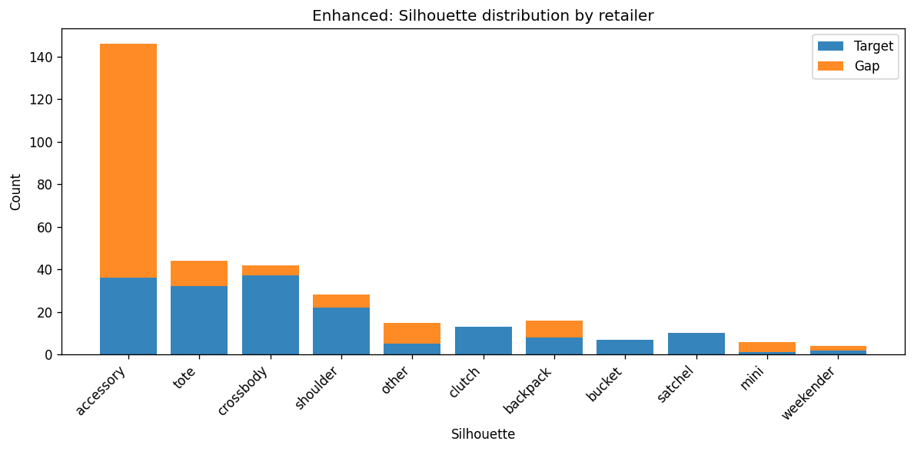
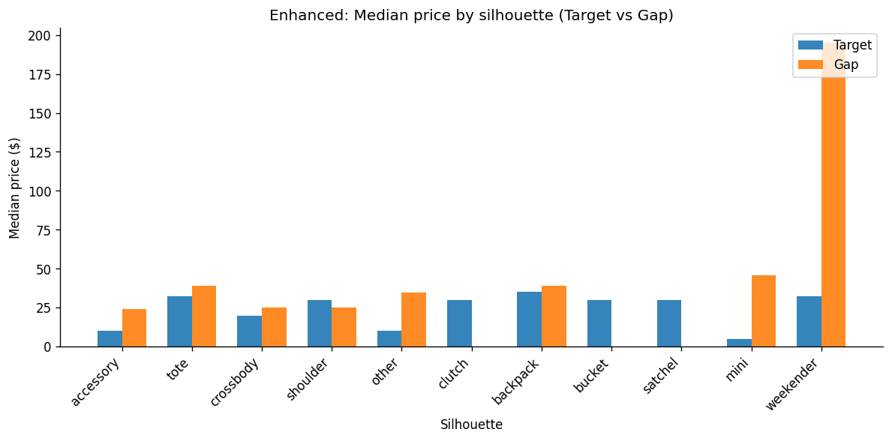
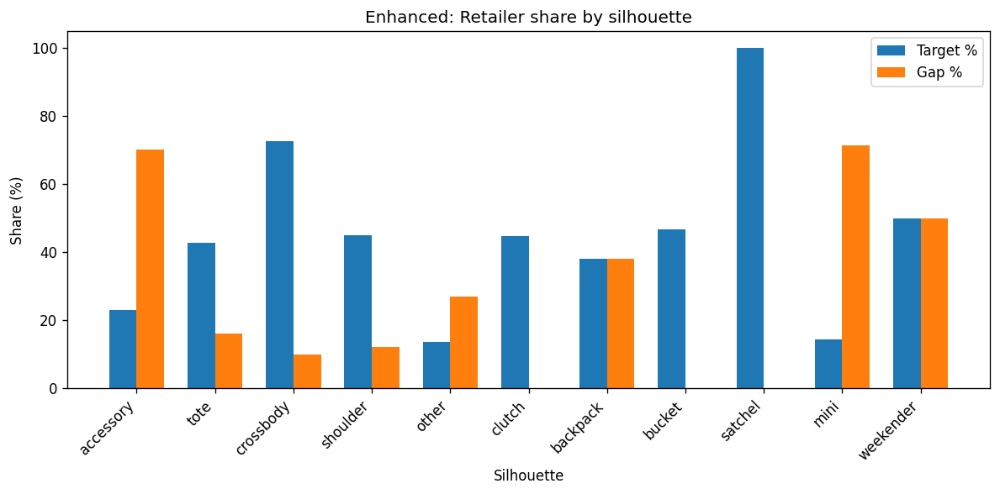
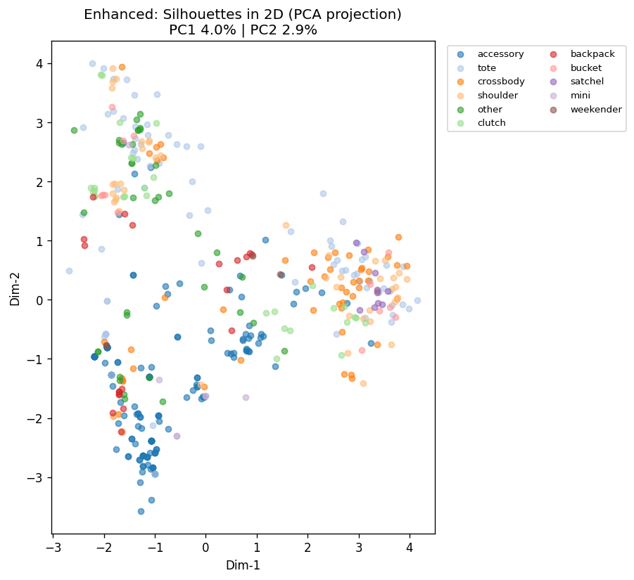

# Enhanced Taxonomy Report

**Date:** 20260224_042243
**Input:** products_mission_enriched.csv

## Clustering quality

- **Mean silhouette (per silhouette):** 0.0254
- **Mean Davies-Bouldin:** 1.80

| Silhouette | N | Clusters | Silhouette | Davies-Bouldin |
|------------|---|----------|------------|----------------|
| clutch | 29 | 5 | 0.014 | 2.59 |
| tote | 75 | 10 | 0.006 | 1.32 |
| accessory | 157 | 10 | 0.009 | 1.80 |
| shoulder | 49 | 9 | -0.010 | 1.23 |
| crossbody | 51 | 10 | -0.010 | 1.39 |
| satchel | 10 | 2 | 0.048 | 2.34 |
| bucket | 15 | 3 | 0.064 | 2.01 |
| other | 37 | 7 | 0.055 | 1.79 |
| backpack | 21 | 4 | 0.053 | 1.71 |

## Comparison (Target vs Gap)

| Metric | Target | Gap |
|--------|--------|-----|
| Count | 173 | 158 |
| Median price | $25.0 | $26.0 |

## Upgrades applied

- Brand tokens from CSV brand column (source=retailer, brand=Champion/Kipling/etc.)
- Statistical stopwords (configurable doc-freq threshold)
- Hybrid embeddings: TF-IDF + bigrams + price bucket + material + is_sale
- HDBSCAN within each silhouette (auto cluster count, noise → nearest cluster)
- Structural word removal (zip, strap, pockets, closure)
- NEW (viz only): PCA/UMAP/t-SNE 2D plots + per-silhouette subcluster plots (reduces clutter)

## Segments (sample)

- **accessory – unknown | care 100 / clean imported | Entry** (99 items)
- **accessory – unknown | charms straps / charm new day | Entry** (31 items)
- **accessory – single** (2 items)
- **tote – leather | features exterior / features exterior featu** (61 items)
- **tote – nylon | double shoulder / triple compartment | Mid** (2 items)
- **tote – single** (5 items)
- **crossbody – unknown | crossbody messenger / crossbody messen** (37 items)
- **crossbody – single** (7 items)
- **crossbody – straw | crossbody messenger / universal thread |** (2 items)
- **shoulder – leather | shoulder universal / care 100 polyester** (39 items)
- **shoulder – single** (6 items)
- **shoulder – leather | trim cotton / magnetic imported | Luxur** (2 items)
- **other – single** (4 items)
- **other – leather | imported select stores / imported select |** (20 items)
- **other – recycled | shop all / recycled materials | Premium** (11 items)

## Visualizations

Per-silhouette plots are saved as:
- `taxonomy_<silhouette>_subclusters.png` (one per silhouette)
