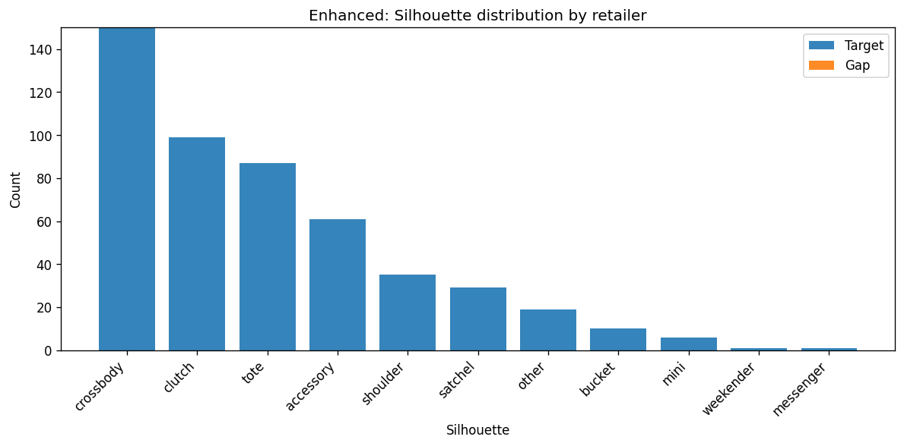
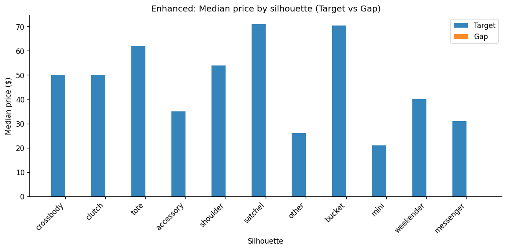
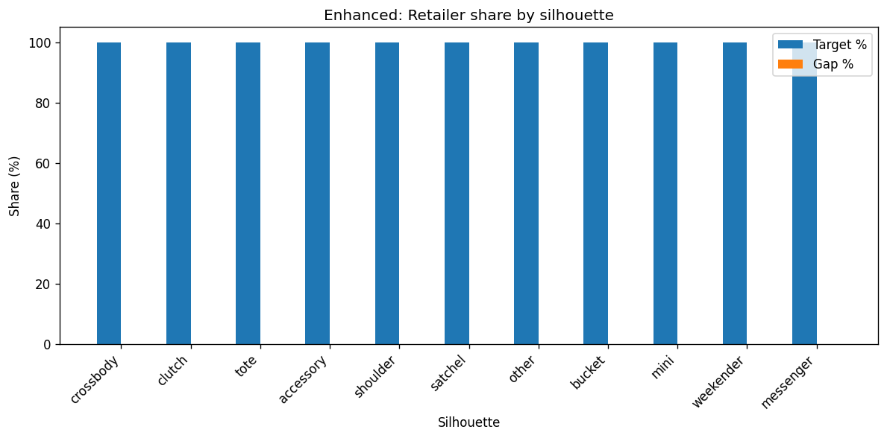
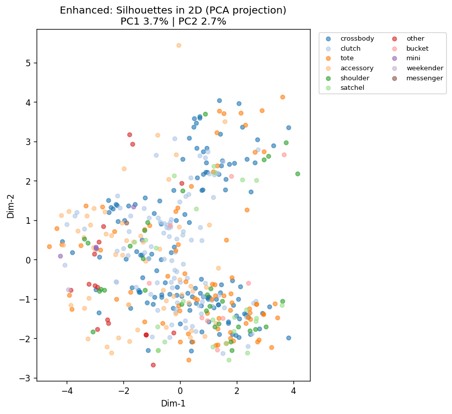

# Enhanced Taxonomy Report

**Date:** 20260223_022358
**Input:** products_test.csv

## Clustering quality

- **Mean silhouette (per silhouette):** 0.0317
- **Mean Davies-Bouldin:** 2.57

| Silhouette | N | Clusters | Silhouette | Davies-Bouldin |
|------------|---|----------|------------|----------------|
| accessory | 61 | 10 | 0.022 | 2.97 |
| crossbody | 150 | 10 | 0.033 | 3.22 |
| clutch | 99 | 10 | 0.010 | 3.10 |
| tote | 87 | 10 | 0.041 | 2.78 |
| shoulder | 35 | 7 | -0.043 | 2.40 |
| other | 19 | 3 | 0.123 | 1.98 |
| satchel | 29 | 5 | 0.010 | 1.80 |
| bucket | 10 | 2 | 0.057 | 2.31 |

## Comparison (Target vs Gap)

| Metric | Target | Gap |
|--------|--------|-----|
| Count | 498 | 0 |
| Median price | $52.0 | $nan |

## Upgrades applied

- Brand tokens from CSV brand column (source=retailer, brand=Champion/Kipling/etc.)
- Statistical stopwords (configurable doc-freq threshold)
- Hybrid embeddings: TF-IDF + bigrams + price bucket + material + is_sale
- HDBSCAN within each silhouette (auto cluster count, noise → nearest cluster)
- Structural word removal (zip, strap, pockets, closure)
- NEW (viz only): PCA/UMAP/t-SNE 2D plots + per-silhouette subcluster plots (reduces clutter)

## Segments (sample)

- **crossbody – vegan_leather | vegan leather / messenger tpu | ** (13 items)
- **crossbody – leather | lightweight multiple / cross body | Mi** (52 items)
- **crossbody – unknown | stadium approved / dome multiple | Mid** (40 items)
- **clutch – unknown | lightweight multiple / shoulder leather |** (45 items)
- **clutch – unknown | design suitable / crossbody wristlet | Mi** (5 items)
- **clutch – leather | detachable straps / multiple detachable s** (12 items)
- **tote – leather | large capacity / shoulder leather | Mid** (38 items)
- **tote – vegan_leather | vegan leather / leather tote | Premiu** (24 items)
- **tote – recycled | universal thread / recycled polyester | Mi** (3 items)
- **accessory – leather | faux leather / rfid protection | Mid** (13 items)
- **accessory – unknown | valentine day / zinc alloy | Entry** (3 items)
- **accessory – unknown | gold tone / charms straps | Entry** (5 items)
- **shoulder – leather | shoulder zipper / shoulder nylon | Mid** (16 items)
- **shoulder – recycled | polyester softside / recycled polyeste** (2 items)
- **shoulder – leather | pink shoulder / hobo shoulder | Mid** (2 items)

## Visualizations

Per-silhouette plots are saved as:
- `taxonomy_<silhouette>_subclusters.png` (one per silhouette)
